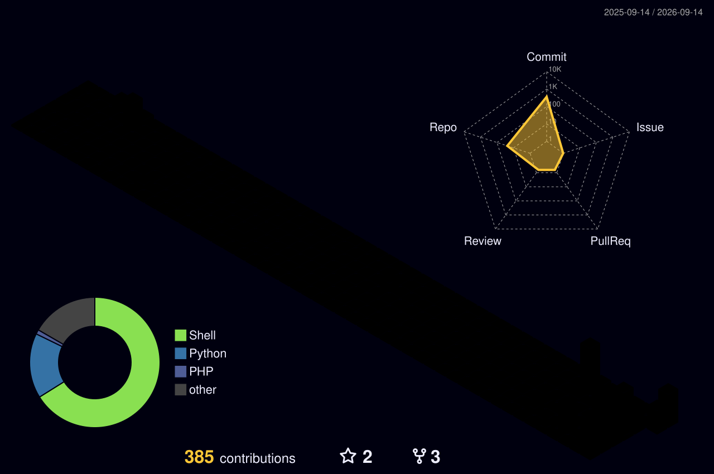

<!--
Repositório de perfil: https://github.com/CarlosSuporteISP/CarlosSuporteISP
Mantenha as informações mais importantes para recrutadores visíveis. As seções técnicas longas permanecem recolhíveis.
-->

# 👋 José Carlos Santos Costa

### Engenheiro Sênior de Redes e Infraestrutura

 

---

## 🚀 Resumo profissional

Sou **Engenheiro Sênior de Redes e Infraestrutura com mais de 12 anos de experiência** projetando, implantando e operando ambientes ISP e corporativos. Minhas áreas mais fortes são **BGP, MPLS, OSPF, IPv4/IPv6, BNG, segurança de roteamento, Linux/Debian, Docker, Proxmox e automação**.

Minha experiência abrange backbone e agregação ISP, acesso de assinantes, peering e trânsito IP, serviços de rede, observabilidade, virtualização e infraestrutura de alta disponibilidade, com experiência prática multivendor em **Huawei, MikroTik, Juniper, Cisco, Datacom, ZTE e Ubiquiti**.

Atualmente, combino consultoria de engenharia, troubleshooting de Nível 3, documentação técnica, projetos de código aberto e treinamentos práticos para profissionais de redes e infraestrutura.

## 🏗️ Portfólio de engenharia

<b>🌍 DNS, virtualização, servidores, serviços, monitoramento e testes</b>

 

<table>
<tr>
<td width="50%" valign="top">

### 🌐 Provedor de Serviços e ISP

- BGP · MPLS · OSPF/OSPFv3 · BFD  
- BNG · PPPoE · IPoE · CGNAT  
- IPv4/IPv6 · RPKI · IRR · Políticas de Roteamento  
- Peering em IX/IXP · Servidores de Rotas · Trânsito IP  
- VLAN · QinQ · VPLS · L2VPN/L3VPN  
- GPON · XG-PON · XGS-PON · EPON

</td>
<td width="50%" valign="top">

### 🌍 Infraestrutura DNS escalável

- DNS autoritativo
- Resolvedores DNS recursivos
- Zonas DNS reversas
- IPv4 e IPv6
- Arquitetura Anycast
- Integração de DNSSEC e segurança de roteamento
- Implantações de Pi-hole
- Ferramentas de propagação e monitoramento de DNS
- Implantações conteinerizadas e reproduzíveis

</td>
</td>
<tr>
<td width="50%" valign="top">

### ☁️ Virtualização, HA e armazenamento

- Clusters Proxmox VE
- Proxmox Datacenter Manager
- Proxmox Backup Server
- Alta disponibilidade
- Clusters Ceph
- Armazenamento distribuído GlusterFS
- Armazenamento de VMs baseado em XFS
- Backup, replicação e recuperação de desastres
- Migração ao vivo e análise de desempenho

</td>
<td width="50%" valign="top">

### 🖥️ Engenharia de servidores físicos

- Gerenciamento de Dell PowerEdge Série R
- HPE ProLiant Gen6, Gen7, Gen8, Gen9 e Gen10
- Administração de HPE Smart Array e Dell PERC
- Modos HBA/RAID, cache, firmware e diagnósticos
- Redes de servidores Mellanox 40/100 GbE
- Plataformas de homelab
- Plataformas de servidores chineses ODM/white-label
- Procedimentos de BIOS, iLO, iDRAC e ciclo de vida
- SSACLI · PERCCLI · Diagnósticos de armazenamento

</td>
</tr>
</td>
<td width="50%" valign="top">

### 📦 Serviços de infraestrutura e automação

- Registro Docker privado
- NTP/NTS com Chrony
- NetBox e phpIPAM
- Portainer
- FTP, TFTP e SFTP
- GenieACS / TR-069
- Passbolt e JumpServer
- Nginx Proxy Manager e Cloudflare Zero Trust
- PostgreSQL, MySQL e TimescaleDB
- Logs centralizados com rsyslog e Graylog
- Linux / Debian / Docker

</td>
<td width="50%" valign="top">

### 📊 Monitoramento e observabilidade

- Zabbix e Grafana
- SmokePing
- PRTG e The Dude
- Páginas de status com Cachet
- Monitoramento de DNS
- Integrações com Downdetector
- Repositórios de MIBs e fluxos de trabalho SNMP
- Topologias de rede e dashboards operacionais

</td>
</tr>
<tr>
<td width="50%" valign="top">

### ⚡ Testes de rede e ferramentas para clientes

- Looking Glass Hyperglass
- nPerf
- Ookla Speedtest
- SIMET
- Minha Conexão
- Verificador de propagação DNS
- Linhas de base de desempenho
- Laboratórios de troubleshooting e validação

</td>
<td width="50%" valign="top">

### 🎓 Comunidade 🤖 Automação e Documentação

- Instrutor técnico  
- Laboratórios práticos  
- Documentação de código aberto
- Shell Script · Python · GitHub Actions · APIs  
- 80+ Dockerfiles · Stacks Compose reutilizáveis  
- Guias técnicos · Diagramas · Hands-on labs

</td>
</tr>
</table>

<b>🐍 Animação do mapa de contribuições</b>

 

  <picture>
    <source media="(prefers-color-scheme: dark)" srcset="./profile/snake-dark.svg">
    <source media="(prefers-color-scheme: light)" srcset="./profile/snake.svg">
    
  </picture>

<b> 🎯 Foco atual</b>

 

- Projetando e solucionando problemas em **backbones ISP, BNG/PPPoE/IPoE, CGNAT, MPLS, IPv6, peering em IX/IXP e trânsito IP**.
- Construindo e operando **Proxmox VE, Proxmox Datacenter Manager, Proxmox Backup Server, clusters HA, Ceph, armazenamento distribuído e laboratórios de desempenho**.
- Projetando plataformas escaláveis de **DNS autoritativo, recursivo e reverso** com IPv4/IPv6, DNSSEC, Anycast, integração com Pi-hole, monitoramento e automação operacional.
- Criando **imagens Docker, stacks Compose, automações em Shell/Python e guias técnicos** reutilizáveis.
- Gerenciando e solucionando problemas em **Dell PowerEdge Série R, HPE ProLiant Gen6–Gen10, homelab e plataformas de servidores chineses ODM/white-label**.
- Ensinando cenários reais de redes, Linux, virtualização, containers e troubleshooting.

<b>📁 Exemplos de repositórios privados e laboratórios internos</b>

 

`00-AUTOMACAO-INSTALACAO` · `03-DNS-Recursivo` · `01_NTP-NTS_Chrony-em-Docker` · `12-Minha-Conexao` · `11-Speedtest` · `07-TFTP` · `15-LG-Hyperglass` · `MON-DNS` · `14-TR-069-GenieACS` · `VMWARE` · `13-Nperf` · `04-NTP` · `MON-COMPLETO-ZABBIX-GRAFANA` · `09-Zabbix-Grafana` · `08-SmokePing`

Esses repositórios permanecem privados porque podem conter estruturas internas de implantação, adaptações específicas de clientes ou material operacional. Suas tecnologias e resultados são representados aqui sem expor dados confidenciais.

## 🧰 Stack de tecnologias interativa

> Clique em um badge para abrir a documentação oficial, a página do produto ou o padrão técnico.

<b> 🌐 Roteamento, Provedor de Serviços e infraestrutura de Internet</b>

 

<b> 🏢 Fabricantes e plataformas de rede</b>

 

<b> 🖥️ Hardware e gerenciamento de servidores</b>

 

<b> 🐧 Linux, virtualização, containers e automação</b>

 

<b> 🗄️ Bancos de dados e dados de séries temporais</b>

 

<b> 🌐 Web, proxy reverso, segurança e Zero Trust</b>

 

<b> 📊 Observabilidade, monitoramento e gerenciamento de infraestrutura</b>

 

<b> 🧪 Projetos de engenharia selecionados</b>

 

<table>
<tr>
<td width="50%" valign="top">

### 🖥️ [Guia de Engenharia HPE DL360 Gen9, DL360 G10, DL380 G10 e Proxmox]

Documentação prática abrangendo firmware, BIOS, iLO, 40/100 GbE, armazenamento, população de memória, hotplug no Proxmox, SSACLI/PERCCLI e validação de desempenho.

`Proxmox` `HPE` `Linux` `Armazenamento` `Documentação`

</td>
<td width="50%" valign="top">

### 🔐 [Controle de Rotas WireGuard para MikroTik](https://github.com/CarlosSuporteISP/Controle_Rotas_WG_MikroTik)

Scripts operacionais e controles de roteamento para ambientes MikroTik usando WireGuard, com foco em administração reproduzível e troubleshooting.

`MikroTik` `WireGuard` `Roteamento` `Shell`

</td>
</tr>

<tr>
<td width="50%" valign="top">

### 📦 [Pure-FTPd TLS + PostgreSQL no Docker](https://github.com/CarlosSuporteISP/PURE-FTP_TLS_PGSQL-Docker)

Infraestrutura FTP conteinerizada com TLS, integração com PostgreSQL e práticas de implantação reproduzíveis.

`Docker` `TLS` `PostgreSQL` `Infraestrutura`

</td>
<td width="50%" valign="top">

### 🌍 [Mapas DNSGlobe — Estados Brasileiros](https://github.com/CarlosSuporteISP/dnsglobe-maps-Br-estados)

Interface de terminal em Rust para visualizar a propagação DNS entre resolvedores públicos, adaptada para visualizações geográficas brasileiras.

`Rust` `DNS` `TUI` `Observabilidade`

</td>
</tr>

<tr>
<td width="50%" valign="top">

### 🧭 [Infraestrutura de DNS Recursivo](https://github.com/CarlosSuporteISP/03-DNS-Recursivo)

Implantação conteinerizada de DNS recursivo com IPv4/IPv6, scripts operacionais e padrões de infraestrutura documentados.

`DNS` `Docker` `IPv6` `Automação`

</td>
<td width="50%" valign="top">

### 🔭 [Hyperglass Structured](https://github.com/CarlosSuporteISP/hyperglass_structured)

Experimentos, integrações e trabalhos orientados ao upstream em plataformas de Looking Glass de rede e visibilidade BGP.

`BGP` `Looking Glass` `Python` `Código Aberto`

</td>
</tr>
</table>

> 💡 Priorizo projetos que transformam a experiência de produção em laboratórios reproduzíveis, automação e documentação que outros engenheiros de redes possam utilizar.

## 📊 Atividade de engenharia no GitHub

<b>🏙️ Calendário 3D de contribuições</b>

 

  

  <picture>
    <source media="(prefers-color-scheme: dark)" srcset="./profile/stats-dark.svg">
    <source media="(prefers-color-scheme: light)" srcset="./profile/stats-light.svg">
    
  </picture>
  <picture>
    <source media="(prefers-color-scheme: dark)" srcset="./profile/top-langs-dark.svg">
    <source media="(prefers-color-scheme: light)" srcset="./profile/top-langs-light.svg">
    
  </picture>

## 🧑‍🏫 Ensino, consultoria e comunidade

- **Instrutor Técnico e Colaborador na SixCore**, ministrando laboratórios práticos de redes, Linux, virtualização, containers, segurança e automação.
- **Consultor de Engenharia de Redes** para ISPs em vários estados brasileiros, apoiando arquitetura, migrações, incidentes de Nível 3 e otimização de desempenho.
- Autor de guias operacionais, diagramas e laboratórios reproduzíveis para ambientes de provedores de serviços e data centers.
- Colaborador em troubleshooting upstream e abertura de issues, incluindo comportamentos complexos de caminhos BGP e confederação em softwares de Looking Glass.
- Interessado em colaborações envolvendo **automação de redes, infraestrutura ISP, observabilidade, documentação e ferramentas de código aberto**.

<b>🏅 Certificações e treinamentos selecionados</b>

 

- Engenheiro de Interconexão Certificado MikroTik — **MTCINE**
- Engenheiro IPv6 Certificado MikroTik — **MTCIPv6E**
- Engenheiro de Controle de Tráfego Certificado MikroTik — **MTCTCE**
- Engenheiro de Roteamento Certificado MikroTik — **MTCRE**
- Associado de Redes Certificado MikroTik — **MTCNA**
- Boas Práticas Operacionais para Sistemas Autônomos — **BCOP / NIC.br**
- Docker para ISPs e Consultores
- Treinamentos selecionados em Juniper BGP/BNG, Huawei BNG/BGP/PBR, Kubernetes, DNS, Zabbix, Proxmox HA e sistemas de arquivos distribuídos

<b>🗓️ Linha do tempo da carreira</b>

 

| Período | Cargo |
|---|---|
| 2026–Atual | Instrutor Técnico e Colaborador — SixCore |
| 2018–Atual | Consultor de Engenharia de Redes — All Safe / Suporte ISP / 4TEC / Galácticos NOC |
| 2019–2020 | Engenheiro de Redes, NOC N3 — Mais Net Telecom |
| 2018–2019 | Engenheiro Sênior de Redes, NOC N3 — Informac Internet |
| 2017–2018 | Engenheiro de Redes de Campo — Veloz.com |
| 2015–2017 | Engenheiro de Redes / Sócio — WS Internet / WSG NET |
| 2007–2015 | Infraestrutura de TI, redes de campo, servidores, CFTV e suporte técnico |

## 🤝 Vamos construir uma infraestrutura confiável

Estou aberto a **oportunidades internacionais remotas, híbridas e presenciais**, relocação, consultoria e contratos de prestação de serviços nas áreas de:

- Engenharia de Redes
- Infraestrutura de Provedor de Serviços / ISP
- Automação de Redes
- Engenharia Linux e de Infraestrutura
- Proxmox / Virtualização / Alta Disponibilidade
- Treinamento Técnico e Documentação

  

_Projetando redes, infraestrutura e conhecimento que escalam._

